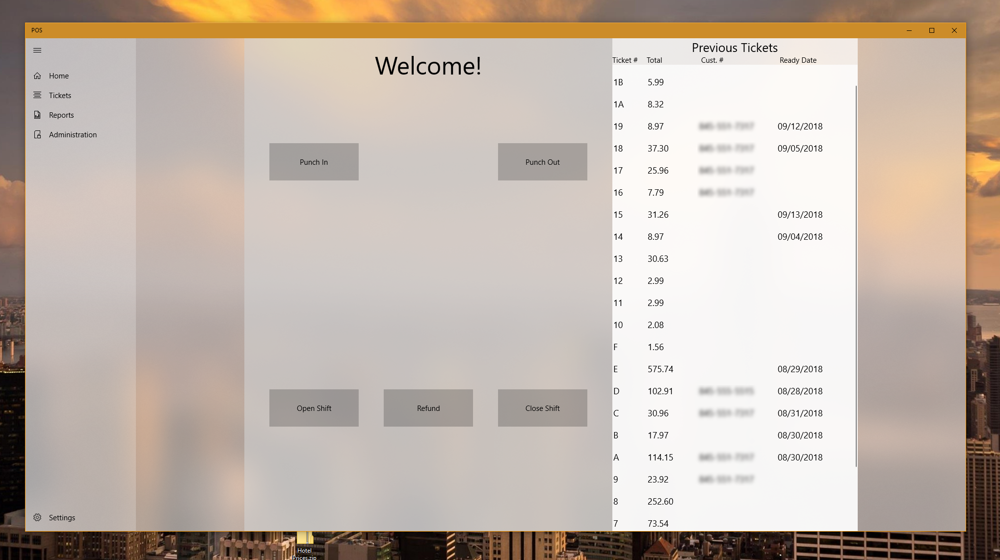
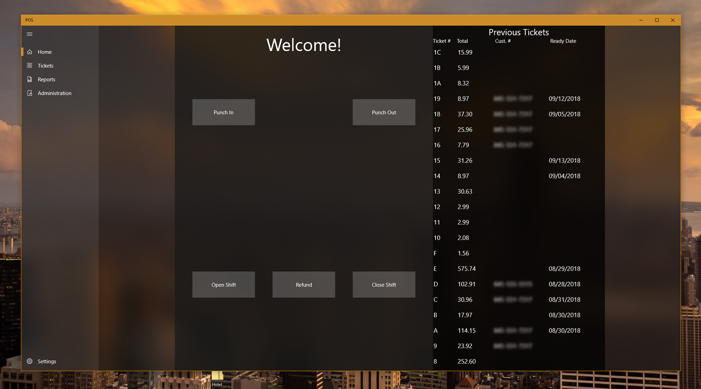

# Point-Of-Sale-UWP
There are files missing from this software intentially due to intelectual property reasons. This project has been in progress since 5/30/2017. I work off of visual studio team services.

<h2>Features</h2>
This app has an intuitive design.  The app features a light and dark theme and follows windows 10's fluent design. The following screen shots are of the home page. 
The home page can be customized to show differnt set of data on the right. For example, last 100 ticket, last 50 tickets, unpaid tickets, etc.
This is also where the emplyoees can punch in and out.

The list of tickets on the right side are interactive. There are serveral options the employee can choose from after clicking on a ticket: Quick View, Edit Ticket, Mark as Picked Up(premature), Print, Email Invoice. 
