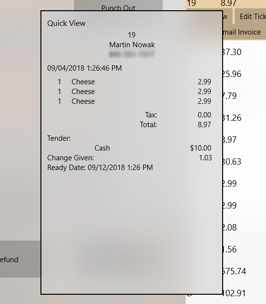
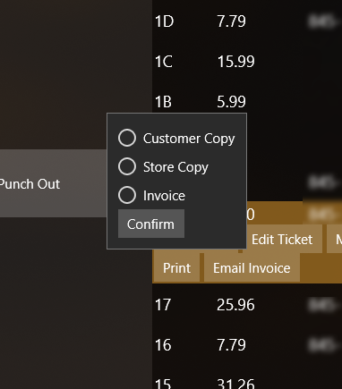

# Point-Of-Sale-UWP
There are files missing from this software intentially due to intelectual property reasons. This project has been in progress since 5/30/2017. I work off of visual studio team services.

<h2>Home Page</h2>
This app has an intuitive design.  The app features a light and dark theme and follows windows 10's fluent design. The following screen shots are of the home page. 
The home page can be customized to show differnt set of data on the right. For example, last 100 ticket, last 50 tickets, unpaid tickets, etc.
This is also where the emplyoees can punch in and out.

The list of tickets on the right side are interactive. There are serveral options the employee can choose from after clicking on a ticket: Quick View, Edit Ticket, Mark as Picked Up(premature), Print, Email Invoice. 

The quick view is a custom element that is used acrosss multiple pages. It is a view of the ticket without going into the edit ticket page. The print button brings up a menu that gives the employee three options to print from: Invoice, Customer Copy, Store Copy. Currently the customer copy and store copy print the same ticket.
 

<h2>Create Ticket Page</h2>
This page is where the employee can create tickets. They can link customers to the ticket on the left by searching for their name, phone, or company(premature) number. The customer panel can be shown or hidden by tapping the arrow. After selecting a customer from the list, their name appear on the top of the ticket. Items and categories are in the center of the screen. The right side of the screen is the ticket and it will show the items, modifiers and discounts. The employee can also add notes to the ticket. The bottom right of the screen shows total, tax and item count.

